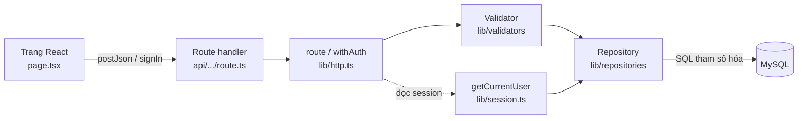
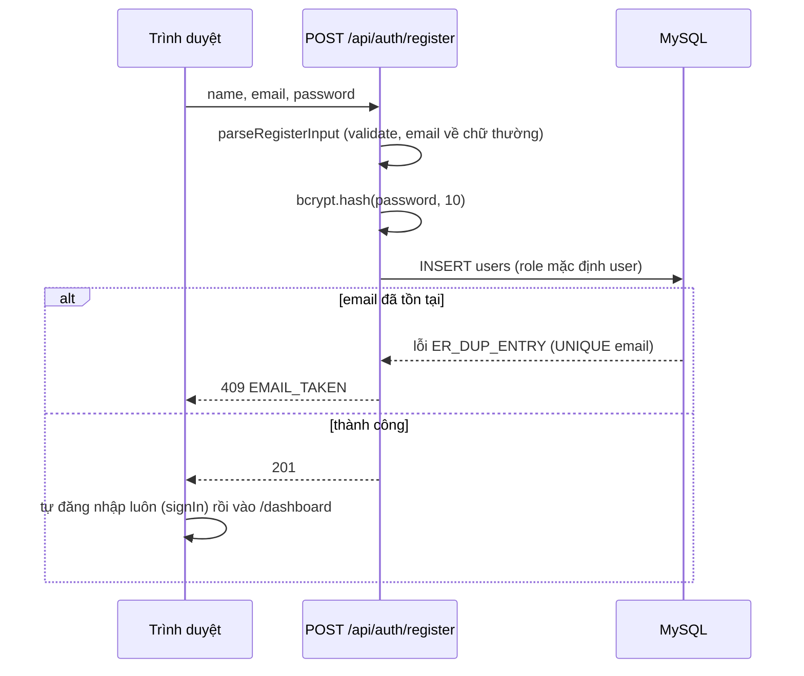
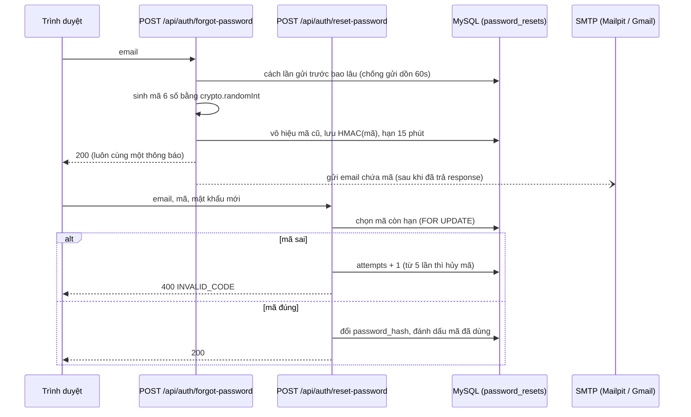
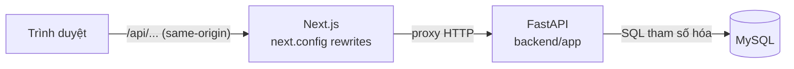

# Ghi chú kỹ thuật: Nền tảng, Xác thực & Phân quyền

Tài liệu này giải thích **đã làm gì, dùng công cụ nào, và logic nối giữa các phần**, để trình bày/bảo vệ đồ án.
Phạm vi: Tuần 1 của kế hoạch (setup, đăng ký/đăng nhập JWT, quên mật khẩu, RBAC, CI) + tính năng "ghi nhớ tài khoản".

> **Lưu ý khi đọc:** Mục 1–13 mô tả kiến trúc **ban đầu** (toàn bộ backend nằm trong Next.js API
> Routes + NextAuth). Đồ án sau đó đã **chuyển backend sang một service Python/FastAPI riêng**
> (xem mục 14) — mục 5.2, 5.3, 6 và một vài câu hỏi ở mục 12 mô tả cơ chế NextAuth cũ, nay đã bị
> thay thế. Giữ nguyên các mục cũ vì đó là lịch sử quyết định thật (đáng nói khi bảo vệ: "ban đầu
> làm X, sau đó đổi sang Y vì lý do Z").

---

## 1. Tóm tắt nhanh

| Yêu cầu | Giải pháp | File chính |
|---|---|---|
| Setup Next.js + MySQL + Docker | Next.js 16 (App Router) + MySQL 8 chạy bằng docker-compose, schema tự nạp | `docker-compose.yml`, `backend/sql/schema.sql` |
| Đăng ký / đăng nhập (JWT) | NextAuth v4 (Credentials + JWT) + bcrypt | `lib/auth.ts`, `api/auth/register/route.ts` |
| Đặt lại mật khẩu | Mã OTP 6 số gửi qua email, nhập mã + mật khẩu mới | `api/auth/forgot-password`, `api/auth/reset-password`, `lib/otp.ts` |
| RBAC theo hành động | Bảng `role -> action` cố định trong code + wrapper `withAuth` | `lib/rbac.ts`, `lib/http.ts` |
| CI | GitHub Actions: lint, typecheck, build | `.github/workflows/ci.yml` |
| Ghi nhớ tài khoản | Lưu email (không lưu mật khẩu) ở localStorage | `lib/remembered-email.ts` |

Toàn bộ đường dẫn `lib/...`, `api/...` nằm dưới `frontend/src/` (`api/` là `frontend/src/app/api/`).

---

## 2. Công nghệ và lý do chọn

| Công nghệ | Dùng để | Vì sao chọn |
|---|---|---|
| Next.js 16 (App Router, TypeScript) | Cả giao diện lẫn API (route handlers) | SRS chốt Next.js làm frontend + backend; 1 project, 1 lần deploy |
| MySQL 8 + `mysql2` (SQL thuần) | Lưu dữ liệu | Đề bài yêu cầu không dùng ORM; câu lệnh tham số hóa `?` chống SQL injection |
| NextAuth v4 (Credentials + JWT) | Đăng nhập, phiên | Đúng SRS; v5 vẫn là bản beta nên chọn v4 (4.24.15 đã hỗ trợ Next 16 / React 19) |
| `bcryptjs` | Băm mật khẩu | Thuần JavaScript, không cần biên dịch native trên Windows/Docker |
| `nodemailer` | Gửi email | Thư viện chuẩn để gửi qua SMTP |
| Docker Compose | Chạy MySQL, Adminer, Mailpit | Môi trường giống nhau ở mọi máy, đúng yêu cầu đề bài |
| Mailpit | Hộp thư giả khi dev | Nhận email từ app, xem tại http://localhost:8025, không cần tài khoản SMTP thật |
| Tailwind CSS | Giao diện | Theo SRS |
| ESLint 9 + `tsc` | Kiểm tra chất lượng | Chạy trong CI để bắt lỗi sớm |

---

## 3. Kiến trúc và đường đi của một request



Vai trò từng lớp (mỗi lớp chỉ làm 1 việc):

1. **Trang (`page.tsx`)**: hiển thị form, kiểm tra nhanh phía client để người dùng thấy lỗi ngay.
2. **`api-client.ts` / `signIn()`**: gọi API, gom lỗi về một dạng `{ ok, data | error }`.
3. **Route handler**: nhận request. Được bọc bởi:
   - `route()`: bắt mọi lỗi và trả JSON lỗi thống nhất `{ error: { code, message, fields } }`.
   - `withAuth(action, handler)`: như `route()` nhưng thêm kiểm tra đăng nhập + quyền.
4. **Validator (`validators/auth.ts`)**: **dùng chung cho client và server**. Client dùng để báo lỗi sớm, server dùng lại để không tin dữ liệu client gửi lên.
5. **Repository (`repositories/*.ts`)**: nơi DUY NHẤT chứa câu SQL. Route không tự viết SQL.
6. **MySQL**: ràng buộc cuối cùng (UNIQUE email, khóa ngoại...).

Vì sao tách như vậy: sửa SQL không đụng route, đổi luật kiểm tra chỉ sửa một nơi, dễ viết unit test (tuần 4).

---

## 4. Môi trường phát triển (Docker)

`docker-compose.yml` có 4 service:

| Service | Cổng máy host | Việc |
|---|---|---|
| `db` (MySQL 8) | **3307** | CSDL. Mount `backend/sql/schema.sql` vào `/docker-entrypoint-initdb.d/` nên **schema tự nạp ở lần khởi tạo đầu tiên** |
| `adminer` | 8080 | Giao diện xem/sửa DB |
| `mailpit` | 1025 (SMTP), 8025 (xem thư) | Hộp thư giả cho dev |
| `app` | 3000 | Build bằng `frontend/Dockerfile` (dùng cho triển khai, chưa được build thử) |

Điểm cần nhớ khi được hỏi:
- **Vì sao cổng 3307?** Máy đã có MySQL cài sẵn chiếm cổng 3306, nên map container ra 3307. Bên trong mạng Docker, service `app` vẫn gọi `db:3306` (vì thế compose đặt `DB_PORT: "3306"` riêng cho `app`).
- Biến môi trường ở `frontend/.env.local` (không commit lên git); mẫu ở `frontend/.env.example`.
- Dữ liệu MySQL nằm trong volume `db_data`, nên tắt/bật container không mất dữ liệu. Nếu sửa `schema.sql` sau khi volume đã có dữ liệu thì phải `ALTER TABLE` thủ công (script nạp chỉ chạy 1 lần).

---

## 5. Xác thực

### 5.1 Đăng ký



Quyết định thiết kế:
- Server **không nhận role từ client**: role luôn là `user` (cột có DEFAULT). Admin chỉ tạo trực tiếp trong DB.
- Chống trùng email bằng **ràng buộc UNIQUE của DB** rồi bắt lỗi `ER_DUP_ENTRY`, thay vì "SELECT rồi INSERT" (cách đó bị race condition khi 2 request cùng lúc).
- Email được chuẩn hóa `trim + lowercase` để `A@x.com` và `a@x.com` là cùng một tài khoản.
- Mật khẩu: tối thiểu 8 ký tự, tối đa 72 byte (bcrypt chỉ dùng 72 byte đầu nên phải chặn để không bị cắt ngầm).

### 5.2 Đăng nhập (NextAuth Credentials + JWT)

```mermaid
sequenceDiagram
  participant U as Trình duyệt
  participant N as NextAuth /api/auth/callback/credentials
  participant DB as MySQL
  U->>N: signIn(email, password)
  N->>DB: findUserByEmail
  N->>N: bcrypt.compare (nếu không có user thì so với hash giả)
  alt sai thông tin hoặc status khác active
    N-->>U: từ chối (thông báo chung)
  else đúng
    N->>N: tạo JWT chứa id và role
    N-->>U: Set-Cookie session-token (httpOnly, hạn 7 ngày)
  end
```



Quyết định thiết kế:
- **Thông báo lỗi chung** "Email hoặc mật khẩu không đúng" cho mọi trường hợp (sai email, sai mật khẩu, tài khoản bị khóa) để không lộ tài khoản nào tồn tại.
- **So với hash giả khi không tìm thấy user** (`DUMMY_HASH`): thời gian phản hồi giống nhau, kẻ tấn công không đo thời gian để dò email.
- Phiên là **JWT nằm trong cookie** (httpOnly, mặc định của NextAuth v4), hạn 7 ngày: đóng trình duyệt mở lại vẫn còn đăng nhập.
- Callback `jwt`/`session` (trong `lib/auth.ts`) nhét `id` và `role` vào token/session; kiểu dữ liệu mở rộng khai báo ở `types/next-auth.d.ts`.

### 5.3 Bảo vệ trang và API: `getCurrentUser()` (điểm mấu chốt)

JWT là "vé" tự chứa, server không lưu phiên. Vấn đề: nếu Admin khóa tài khoản, JWT cũ vẫn còn hạn. Cách xử lý:

```
getCurrentUser():
  1. getServerSession()          -> đọc và kiểm tra chữ ký JWT trong cookie
  2. findUserById(session.id)    -> ĐỌC LẠI user từ DB
  3. nếu không có / status != 'active' -> coi như chưa đăng nhập
  4. trả về { id, name, email, role } lấy từ DB (không lấy từ token)
```

Hệ quả: khóa tài khoản hoặc đổi vai trò có hiệu lực **ngay lập tức**, dù token còn hạn. Đổi lại mỗi request tốn 1 truy vấn nhỏ theo khóa chính. Hàm bọc bằng `cache()` của React nên trong cùng một request (layout + page) chỉ truy vấn 1 lần.

Nơi dùng:
- `(dashboard)/layout.tsx`: không có user thì `redirect("/login")` (bảo vệ mọi trang trong nhóm dashboard).
- `withAuth` (dưới đây): bảo vệ API.

---

## 6. Phân quyền RBAC theo hành động

`lib/rbac.ts` định nghĩa 20 action đúng theo ma trận ở `docs/SRS.md` §4 (ví dụ `transactions.create`, `categories.manage_default`, `users.lock_unlock`) và bảng `role -> tập action`:

```ts
can(role, action)  // true nếu role đó được phép thực hiện action
```

`withAuth(action, handler)` (trong `lib/http.ts`) chạy theo thứ tự:

```
1. user = getCurrentUser()
2. user == null              -> 401 UNAUTHENTICATED
3. !can(user.role, action)   -> 403 FORBIDDEN
4. gọi handler(req, ctx, user)
```

Ví dụ dùng: `export const GET = withAuth("dashboard.view_own", async (req, ctx, user) => ...)`.

Nhấn mạnh khi trình bày:
- Quyền kiểm tra **theo hành động cụ thể**, không rải `if (role === 'admin')` khắp nơi: một bảng duy nhất, dễ kiểm tra và mở rộng.
- `transactions.view_others` **không gán cho role nào** (kể cả Admin): quyền riêng tư dữ liệu tài chính, đúng NFR-06.
- Đã kiểm chứng bằng script: đối chiếu 20 action x 2 role với SRS, không lệch chỗ nào.
- `GET /api/me` là endpoint nhỏ để chứng minh đường ống `withAuth` chạy (401 khi chưa đăng nhập, 200 khi đã đăng nhập).

---

## 7. Quên mật khẩu bằng mã OTP

Luồng người dùng: nhập email, nhận mã 6 số qua email, nhập mã + mật khẩu mới, rồi đăng nhập bằng mật khẩu mới.



Các lớp bảo vệ (mỗi dòng là một câu hỏi bảo vệ có thể gặp):

| Rủi ro | Cách chặn | Nằm ở |
|---|---|---|
| Đoán mã (chỉ 1 triệu khả năng) | Tối đa **5 lần sai**, sau đó mã bị hủy dù lần sau nhập đúng; hạn **15 phút** | `reset-password/route.ts`, cột `attempts` |
| Lộ DB thì đọc được mã | Chỉ lưu **HMAC-SHA256** (khóa bí mật của server + user id), không lưu mã thô. SHA-256 thường thì dò ngược 1 triệu mã trong tích tắc | `lib/otp.ts` (`hashOtp`) |
| Dò xem email nào đã đăng ký | "Quên mật khẩu" **luôn trả cùng một thông báo**; "sai mã / email lạ / hết hạn" cũng cùng một lỗi | cả hai route |
| Spam hộp thư người khác | Cách lần gửi trước < 60 giây thì không gửi thêm | `forgot-password/route.ts` |
| So sánh mã bị đo thời gian | `timingSafeEqual` | `otpMatches` |
| Hai người nhập mã cùng lúc vượt số lần thử | Khóa dòng bằng `SELECT ... FOR UPDATE` trong transaction | `findActiveCode` |
| Đo thời gian để biết email có tồn tại | Gửi email bằng `after()` (chạy sau khi đã trả response) | `forgot-password/route.ts` |
| Mã cũ còn dùng được | Mỗi lần gửi mã mới sẽ vô hiệu mã cũ | `invalidateActiveCodes` |

Chi tiết cần nhớ:
- **Nhập sai mã vẫn phải COMMIT** để ghi số lần thử. Hàm `withTransaction` chỉ rollback khi có lỗi ném ra, nên route trả kết quả `"invalid"` (không ném) thì transaction vẫn commit phần `attempts + 1`.
- Băm mật khẩu mới bằng bcrypt **chỉ khi mã đã đúng** (không tốn CPU cho các lần đoán sai).
- Bảng `password_resets` (đã thêm cột `attempts`): `token` chứa HMAC của mã, `expires_at`, `used_at` (đã dùng hoặc bị thay thế).
- Email dev đi qua **Mailpit** (`SMTP_HOST=localhost`, `SMTP_PORT=1025`), xem tại http://localhost:8025. Email **không** tới Gmail thật cho tới khi cấu hình SMTP thật (mục 10).

---

## 8. Ghi nhớ tài khoản (trang đăng nhập)

- Ô "Ghi nhớ tài khoản" (mặc định tích). Đăng nhập **thành công** thì lưu **chỉ email** vào `localStorage` (khóa `vivang:remembered-email`); bỏ tích thì xóa. Lần sau ô email được điền sẵn.
- **Không bao giờ lưu mật khẩu.** Mật khẩu để trình quản lý mật khẩu của trình duyệt xử lý (form có `autoComplete` đúng chuẩn).
- Đăng nhập sai thì không lưu gì.
- Cài đặt: hook `useRememberedEmail()` dùng `useSyncExternalStore` để đọc localStorage. Cách này đúng chuẩn React: server trả chuỗi rỗng, client cập nhật sau khi hydrate nên **không lệch HTML**. Lúc đầu viết bằng `useEffect + setState` thì ESLint (luật `react-hooks/set-state-in-effect`) báo lỗi; bước lint nằm trong CI nên nếu để nguyên thì CI sẽ đỏ.
- Ô email hiển thị `typedEmail ?? savedEmail`: hiện email đã lưu cho tới khi người dùng tự gõ.
- "Giữ đăng nhập" là chuyện khác: phiên JWT đã sống 7 ngày nhờ cookie bền.

---

## 9. CI và cách kiểm thử

**CI** (`.github/workflows/ci.yml`, chạy khi push lên `main` và khi có pull request): `npm ci`, `npm run lint`, `npm run typecheck`, `npm run build` (Node 20, thư mục `frontend`). Workflow chưa được chạy trên GitHub; các bước tương đương đã chạy thành công ở máy.

**Kiểm thử đã thực hiện** (script chạy tạm, chưa đưa vào repo; kế hoạch chuyển thành Jest + Supertest ở tuần 4):

| Loại | Cách làm | Kết quả |
|---|---|---|
| API đầu-cuối | Script Node gửi HTTP thật tới server đang chạy, có giữ cookie; đọc mã từ API của Mailpit; kiểm tra thẳng DB bằng `mysql` trong container | 33/33: đăng ký, đăng nhập, session, `withAuth`, OTP (sai mã, khóa sau 5 lần, chống gửi dồn), tài khoản bị khóa |
| Giao diện thật | Điều khiển **Chrome thật** qua Chrome DevTools Protocol (điền form, bấm nút, đọc localStorage/cookie) | Ghi nhớ tài khoản 12/12; luồng quên mật khẩu trên UI 9/9 |
| Ma trận phân quyền | Script đối chiếu `can(role, action)` với SRS §4 | 20/20 action khớp |
| Chất lượng code | `eslint`, `tsc --noEmit`, `next build` | Đều qua |

Lý do kiểm thử bằng trình duyệt thật: lỗi về hydrate, localStorage, cookie chỉ lộ ra khi chạy trên trình duyệt.

---

## 10. Cấu hình gửi email thật (Gmail)

Mặc định dev dùng Mailpit. Để email tới Gmail thật, sửa `frontend/.env.local` rồi **khởi động lại** `npm run dev` (biến môi trường chỉ đọc lúc khởi động):

```
SMTP_HOST=smtp.gmail.com
SMTP_PORT=587
SMTP_USER=<địa chỉ gmail của bạn>
SMTP_PASSWORD=<Mật khẩu ứng dụng 16 ký tự>
SMTP_FROM="VíVàng <địa chỉ gmail của bạn>"
```

- `SMTP_PASSWORD` **không phải** mật khẩu Gmail. Phải bật xác minh 2 bước rồi tạo "Mật khẩu ứng dụng" tại https://myaccount.google.com/apppasswords.
- Không commit `.env.local` (đã nằm trong `.gitignore`).
- Thư lần đầu có thể vào mục Spam.
- Nếu gửi lỗi, terminal chạy `npm run dev` in dòng `[auth] gửi email mã xác nhận thất bại` kèm nguyên nhân (người dùng vẫn nhận phản hồi 200 chung để không lộ thông tin).

---

## 11. Sự cố đã gặp và cách xử lý (rất hay bị hỏi)

| Sự cố | Nguyên nhân | Cách xử lý |
|---|---|---|
| Cổng 3306 bị chiếm khi bật MySQL Docker | Máy có MySQL cài sẵn | Map container ra 3307; đặt `DB_PORT=3306` riêng cho service `app` trong Docker |
| `npm audit` báo lỗ hổng nghiêm trọng ở Next.js 14 | Bản cũ dính nhiều CVE, một số chỉ được vá ở Next 16 | Dự án mới nên nâng thẳng lên Next 16 (chi phí thấp) |
| `next lint` không chạy | Next 16 đã **xóa** lệnh này | Đổi script thành `eslint .`, thêm `eslint.config.mjs` |
| `middleware.ts` | Next 16 đổi tên thành `proxy.ts` | Ghi nhận khi làm bảo mật (Origin/CSRF) ở tuần 2 |
| ESLint báo `getFilename is not a function` | ESLint 10 làm hỏng plugin React của `eslint-config-next` | Hạ xuống ESLint 9.39.5 |
| `nodemailer` bản mặc định có lỗ hổng, `npm ci` lỗi peer | next-auth khai báo peer `nodemailer@^7`, npm chọn bản 7 (dính CVE) | Nâng nodemailer 10.0.10 và thêm `overrides` trong `package.json` |
| Lint lỗi `set-state-in-effect` | Gọi `setState` trực tiếp trong `useEffect` | Đổi sang `useSyncExternalStore` |
| "Chưa thấy mã trong email" | Dev đang dùng Mailpit, không phải Gmail | Xem thư ở http://localhost:8025, hoặc cấu hình SMTP thật (mục 10) |

---

## 12. Câu hỏi thường gặp khi bảo vệ

**Vì sao dùng JWT mà mỗi request vẫn truy vấn DB?**
JWT giúp không phải lưu phiên ở server, nhưng token không thể "thu hồi". Đọc lại `status` và `role` từ DB (`getCurrentUser`) để khóa tài khoản hay đổi vai trò có hiệu lực ngay, đổi lại 1 truy vấn theo khóa chính mỗi request.

**Vì sao không lưu mã OTP dạng thô, hay chỉ băm SHA-256?**
Mã chỉ có 1 triệu khả năng: lộ DB thì SHA-256 dò ngược được ngay. HMAC cần khóa bí mật của server (không nằm trong DB) nên kẻ có DB vẫn không dò được.

**Vì sao quên mật khẩu luôn trả thành công dù email không tồn tại?**
Để kẻ xấu không dùng form này để dò xem email nào đã đăng ký. Các lỗi ở bước nhập mã cũng dùng chung một thông báo vì cùng lý do.

**Chống tấn công dò mã thế nào?**
Giới hạn 5 lần sai (đếm trong DB, có khóa dòng), mã hết hạn sau 15 phút, mỗi lần gửi mã mới hủy mã cũ, và chỉ được gửi mã mới sau 60 giây.

**Vì sao SQL thuần, không ORM?** Yêu cầu của đề bài. Toàn bộ câu SQL nằm trong `repositories/`, luôn dùng tham số `?` nên không bị SQL injection; ràng buộc (UNIQUE, khóa ngoại) do DB đảm bảo.

**Vì sao validator dùng chung client và server?**
Client kiểm tra để phản hồi nhanh; server kiểm tra lại vì không được tin dữ liệu từ client. Dùng chung một mã nguồn để hai bên không lệch luật.

**Vì sao có `FOR UPDATE` và transaction khi đổi mật khẩu?**
Để việc "kiểm tra mã, đổi mật khẩu, đánh dấu mã đã dùng" là một khối nguyên tử; hai request đồng thời không cùng dùng một mã hay vượt giới hạn số lần thử.

**bcryptjs khác bcrypt?** Cùng thuật toán; bcryptjs viết bằng JavaScript nên không cần biên dịch, cài đặt dễ trên Windows/Docker, chậm hơn một chút nhưng không đáng kể ở cost 10.

**Vì sao dùng NextAuth v4 mà không phải v5?** v5 vẫn ở bản beta; v4 ổn định, có sẵn Credentials provider và JWT đúng như SRS.

---

## 13. Hạn chế và hướng phát triển (nêu rõ trong báo cáo)

- **Chưa có rate limiting** cho đăng nhập/đăng ký: sẽ làm ở task 2.6 (lưu trong bộ nhớ, đúng khi chạy 1 instance; Redis đã loại khỏi phạm vi).
- **Phiên cũ không bị thu hồi khi đổi mật khẩu** (JWT không thu hồi được): các phiên đang mở vẫn dùng được tới khi hết hạn 7 ngày. Hướng cải tiến: thêm cột `password_changed_at` và so với thời điểm phát hành token.
- Đăng ký trả 409 khi email đã tồn tại, nên có thể bị dùng để dò email (đánh đổi để người dùng biết lý do lỗi); giảm nhẹ bằng rate limiting.
- Chưa có giao diện Admin để khóa/mở tài khoản (tuần 3); hiện kiểm chứng việc khóa bằng cách sửa trực tiếp cột `status`.
- `frontend/Dockerfile` (service `app`) và workflow CI chưa được chạy thực tế.
- Kiểm thử hiện là script chạy tay, chưa có bộ test tự động trong repo.

---

## Phụ lục: bản đồ file

```
frontend/src/
├── app/
│   ├── (auth)/{login,register,forgot-password,reset-password}/page.tsx   giao diện xác thực
│   ├── (dashboard)/layout.tsx                                             chặn người chưa đăng nhập
│   ├── (dashboard)/dashboard/page.tsx                                     trang sau đăng nhập (tạm)
│   └── api/
│       ├── auth/[...nextauth]/route.ts        NextAuth (đăng nhập, session, csrf)
│       ├── auth/register/route.ts
│       ├── auth/forgot-password/route.ts
│       ├── auth/reset-password/route.ts
│       └── me/route.ts                        kiểm chứng withAuth
├── lib/
│   ├── auth.ts             cấu hình NextAuth (authorize, jwt, session)
│   ├── session.ts          getCurrentUser (JWT + đọc lại DB)
│   ├── rbac.ts             action, role, can()
│   ├── http.ts             route(), withAuth(), lỗi API thống nhất
│   ├── db.ts               pool mysql2, withTransaction, isDuplicateEntry
│   ├── otp.ts              sinh mã, HMAC, so sánh an toàn
│   ├── mail.ts             nodemailer, mẫu email mã xác nhận
│   ├── api-client.ts       postJson cho phía client
│   ├── remembered-email.ts ghi nhớ email
│   ├── validators/auth.ts  luật kiểm tra dùng chung client + server
│   └── repositories/{users,password-resets}.ts   toàn bộ SQL
├── components/{auth,ui}/   AuthShell, SignOutButton, TextField, Button, FormAlert, icons
└── types/next-auth.d.ts    mở rộng kiểu Session/JWT (id, role)
backend/sql/schema.sql      7 bảng + view v_budget_usage
docker-compose.yml          db, adminer, mailpit, app
.github/workflows/ci.yml    CI
```

---

## 14. Chuyển backend sang Python/FastAPI (đợt 2)

### 14.1 Vì sao đổi

Ban đầu Next.js đóng cả vai trò frontend lẫn backend (API Routes + NextAuth, mục 1–13). Đồ án
sau đó chuyển toàn bộ logic nghiệp vụ, truy cập DB, phát hành JWT và gửi email sang một service
**Python (FastAPI)** độc lập trong `backend/app/`. Next.js chỉ còn là client hiển thị giao diện.

Lý do: tách rõ ràng giữa client và server đúng tinh thần "kiến trúc hướng dịch vụ" của học phần
— thay vì một tiến trình Next.js duy nhất xử lý cả UI lẫn API (monolith), giờ có hai tiến trình
độc lập, có thể triển khai/scale riêng, giao tiếp qua HTTP.

### 14.2 Kiến trúc: vì sao trình duyệt không cần biết có 2 service

Thay vì để trình duyệt gọi thẳng sang origin thứ hai (phải xử lý CORS + cookie cross-site),
`frontend/next.config.mjs` khai báo `rewrites()`: mọi request `/api/*` được Next.js **âm thầm
chuyển tiếp** (proxy) sang FastAPI (`BACKEND_URL`, ví dụ `http://api:8000` trong Docker).



Hệ quả:
- `frontend/src/lib/api-client.ts` (fetch tới `/api/...`) **không cần sửa gì** — vẫn gọi đường dẫn tương đối như cũ.
- FastAPI set cookie JWT (`httponly`, `samesite=lax`) khi login; vì trình duyệt chỉ thấy 1 origin (chính Next.js), cookie tự nhiên là first-party, không cần cấu hình CORS-with-credentials.
- Trang bảo vệ (`(dashboard)/layout.tsx`) gọi `getCurrentUser()` (`frontend/src/lib/session.ts`) — hàm này giờ **gọi sang FastAPI** (`GET /api/me`), chuyển tiếp header `Cookie` của request gốc, thay vì tự giải mã JWT bằng NextAuth.

### 14.3 Đăng nhập/đăng xuất không còn qua NextAuth

| Trước (NextAuth) | Sau (FastAPI) |
|---|---|
| `signIn("credentials", {...})` | `postJson("/api/auth/login", {email, password})` — FastAPI verify bcrypt, set cookie |
| `signOut({callbackUrl})` | `postJson("/api/auth/logout", {})` rồi `router.push("/login")` |
| Session đọc qua `getServerSession(authOptions)` | Next.js server gọi `GET /api/me` kèm cookie chuyển tiếp |

Cơ chế "mỗi request đọc lại `status`/`role` từ DB thay vì tin token" (mục 5.3) **được giữ
nguyên 1:1** ở `backend/app/deps.py::get_current_user` — đây là điểm mấu chốt cũ vẫn còn quan trọng.

### 14.4 Vì sao FastAPI, vì sao `aiomysql` (không ORM)

- **FastAPI**: gõ kiểu bằng Pydantic, tài liệu Swagger tự sinh (`/docs`), async tự nhiên, phổ biến cho backend Python hiện nay.
- **`aiomysql`** thay vì ORM (SQLAlchemy/Django ORM): đề bài yêu cầu SQL thuần; `aiomysql` là driver thuần túy (`cursor.execute(sql, params)`), không có lớp trừu tượng ORM, giữ đúng tinh thần yêu cầu — tương đương vai trò của `mysql2` bên Node trước đây.
- **RBAC** (`backend/app/rbac.py`) là bản dịch 1:1 của `lib/rbac.ts` cũ: cùng 20 action, cùng ma trận quyền, cùng nguyên tắc `transactions.view_others` không role nào được cấp (NFR-06).

### 14.5 Sự cố đã gặp khi port (đáng nói khi bảo vệ)

| Sự cố | Nguyên nhân | Cách xử lý |
|---|---|---|
| `aiomysql` không kết nối được MySQL 8 | MySQL 8 mặc định dùng `caching_sha2_password`, cần package `cryptography` để giải mã RSA challenge | Thêm `cryptography` vào `requirements.txt` |
| Gửi email qua Mailpit báo lỗi `SMTP STARTTLS extension not supported` | `aiosmtplib.send(..., start_tls=True)` bắt buộc STARTTLS, còn Mailpit không hỗ trợ; bản Node (`nodemailer`) mặc định STARTTLS là *tùy chọn* (opportunistic), không bắt buộc | Đổi `start_tls=None` (thử STARTTLS nếu server hỗ trợ, không bắt buộc) khi không phải cổng 465 |
| Log tiếng Việt làm crash server trên Windows (`UnicodeEncodeError`, codepage cp1258) | Console Windows mặc định không dùng UTF-8; `print()` với dấu tiếng Việt bị lỗi encode, và vì lỗi xảy ra ngay trong exception handler nên request trả về "Internal Server Error" trần trụi thay vì JSON lỗi chuẩn | Ép `sys.stdout`/`sys.stderr` sang UTF-8 (`reconfigure`) lúc khởi động `main.py`, đổi toàn bộ `print()` log sang `logging` |
| `GET /api/admin/users` từng trả cả `password_hash` | Bản Node gốc (`listUsers`) SELECT luôn cột `password_hash` dù route không lọc ra — rò rỉ hash mật khẩu cho Admin | Sửa khi port: bỏ `password_hash` khỏi câu SELECT của endpoint danh sách user (không port nguyên lỗi này) |

### 14.6 Đã kiểm thử

Test tay end-to-end qua HTTP thật (giữ cookie phiên) nhắm vào FastAPI chạy cục bộ, trỏ vào MySQL
của `docker-compose` (`db`) và Mailpit: đăng ký → đăng nhập → đổi mật khẩu qua email OTP (đọc mã
thật từ Mailpit) → tạo category/transaction/budget → dashboard tính đúng % ngân sách → export/
import CSV → thao tác Admin (khóa user, xem audit log, chặn không khóa được Admin khác) → đăng
xuất → xác nhận cookie bị hủy (`/api/me` trả 401).

### 14.7 Việc còn lại (đã bàn giao, chưa tự thực hiện được)

Vì lý do an toàn (thao tác xóa hàng loạt bị chặn bởi lớp phân quyền tự động của công cụ hỗ trợ),
các file sau **cần tự tay xóa** vì đã được thay thế hoàn toàn bởi `backend/app/`:

- `frontend/src/app/api/` (toàn bộ — các route Next.js cũ)
- `frontend/src/types/next-auth.d.ts`
- `frontend/src/lib/auth.ts`, `db.ts`, `rbac.ts`, `http.ts`, `otp.ts`, `mail.ts`
- `frontend/src/lib/repositories/` (toàn bộ)
- `frontend/src/lib/validators/{user,transaction,category,budget,reminder}.ts` (giữ lại `validators/auth.ts` — vẫn dùng ở phía client)

Sau khi xóa, chạy `npm install` lại ở `frontend/` (đã bỏ `next-auth`, `bcryptjs`, `mysql2`,
`nodemailer` khỏi `package.json`) rồi `npm run typecheck` để xác nhận không còn tham chiếu vỡ.
